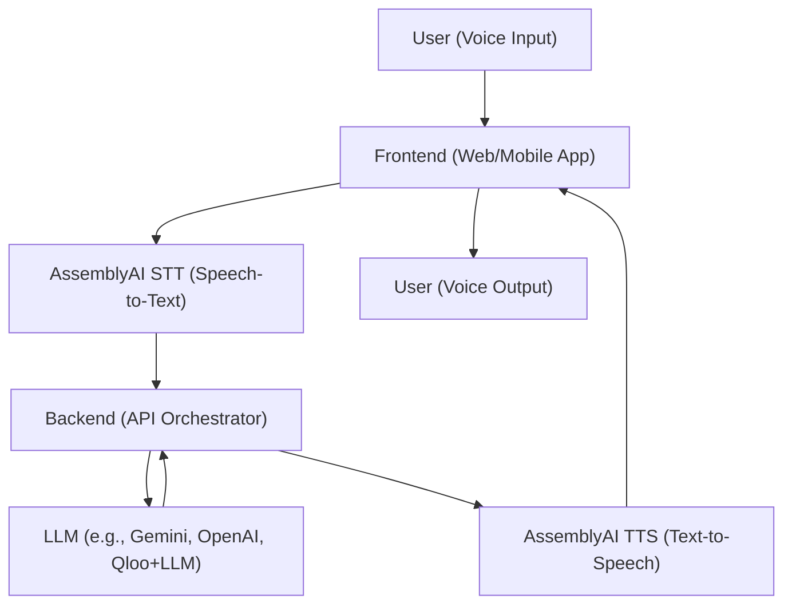

# AssemblyAI Voice Assistant Project – Design Specification

---

## 1. System Architecture Diagram



---

## 2. User Flow

1. **User speaks** into the microphone on the web/mobile app.
2. **Frontend** streams audio to AssemblyAI STT.
3. **STT** transcribes speech to text and sends it to the backend.
4. **Backend** manages chat history/context and sends the text to the LLM (e.g., Gemini, Qloo+LLM).
5. **LLM** generates a response (answer, recommendation, etc.).
6. **Backend** receives the LLM response and sends it to AssemblyAI TTS.
7. **TTS** converts the response to audio.
8. **Frontend** plays the audio back to the user.

---

## 3. UI/UX Wireframe (Web Example)

```
+------------------------------------------------------+
|  AssemblyAI Voice Assistant                          |
+------------------------------------------------------+
|  [ Conversation Window ]                             |
|  -----------------------------------------------    |
|  User: "What's the weather today?"                  |
|  Assistant: "The weather is sunny and 25°C."        |
|  ...                                                |
|                                                     |
|  [ Microphone Button ]  [ Stop ]  [ Settings ]       |
|                                                     |
|  [ Real-time transcription appears here... ]         |
+------------------------------------------------------+
|  [ Status: Listening... / Processing... / Speaking ] |
+------------------------------------------------------+
```

**Key UI Elements:**
- Microphone button for starting/stopping voice input
- Real-time transcription display
- Conversation history window
- Status indicator (listening, processing, speaking)
- Accessibility: high-contrast mode, keyboard navigation, screen reader support

---

## 4. Component Breakdown

### **Frontend**
- Audio capture (microphone)
- Real-time transcription display
- Audio playback
- Conversation history UI
- Accessibility features

### **Backend**
- API endpoints for STT, LLM, TTS orchestration
- Chat history/context management
- User/session management
- Security (API key handling, HTTPS)

### **Integrations**
- AssemblyAI STT & TTS APIs
- LLM API (Gemini, OpenAI, or custom)
- Optional: Qloo API, CRM, etc.

---

## 5. Accessibility & UX Considerations

- Screen reader compatibility
- Keyboard navigation
- High-contrast color schemes
- Clear error and status messages
- Multi-device support (responsive design)

---

## 6. Example API Sequence

1. **POST /stt**  
   → Audio stream → AssemblyAI STT → `{ text: "..." }`
2. **POST /chat**  
   → `{ text, chat_history }` → LLM → `{ reply: "..." }`
3. **POST /tts**  
   → `{ text: reply }` → AssemblyAI TTS → `{ audio_url: "..." }`

---

## 7. Sample Conversation Flow

- **User:** “Book me a table for two at an Italian restaurant tonight.”
- **Assistant:** “Sure! Would you like a recommendation or do you have a place in mind?”
- **User:** “A recommendation, please.”
- **Assistant:** “I recommend Trattoria Bella. Shall I make a reservation for 7 PM?”
- **User:** “Yes, please.”
- **Assistant:** “Done! Your table is booked for 7 PM at Trattoria Bella.”

---

_You can copy this design output into a new file (e.g., design.md) or append it to your requirements.md for a complete project blueprint. If you want a Figma/visual wireframe or more detailed component diagrams, let me know!_
